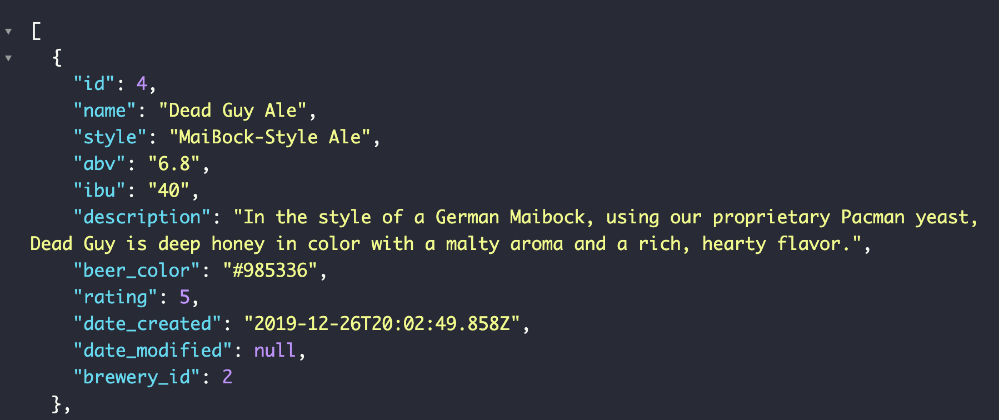
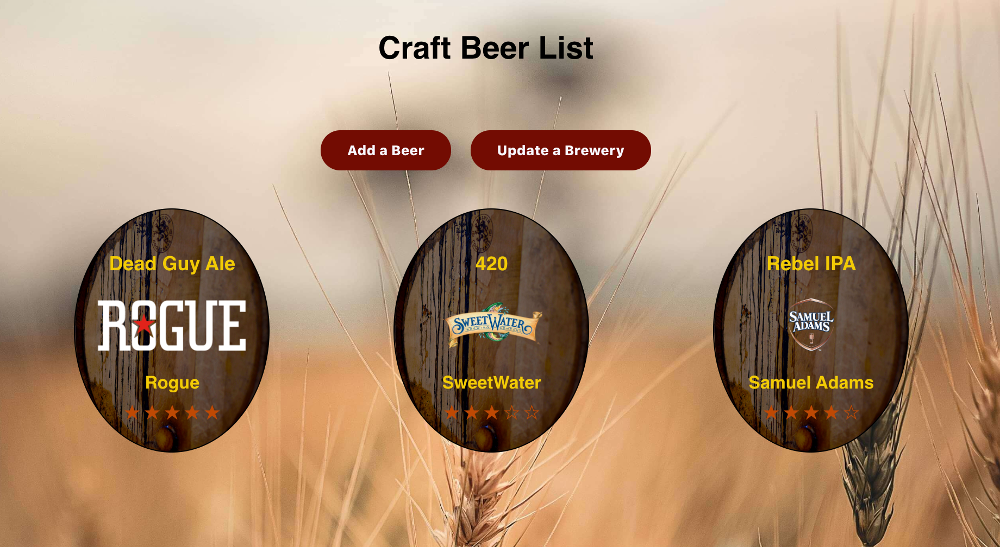
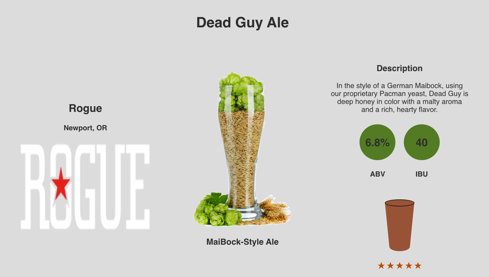
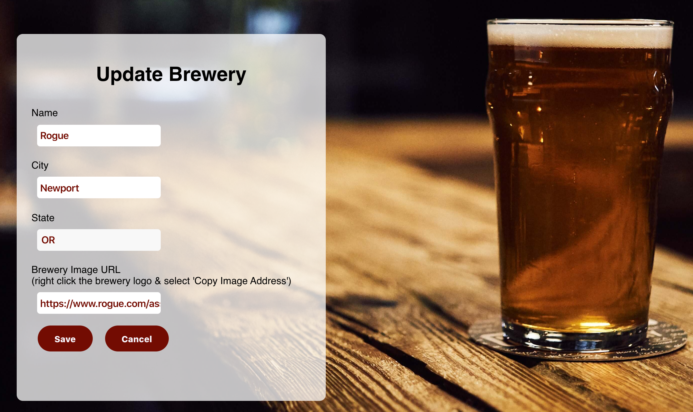

# Craft Brew Locker API

## Summary
A web API to catalog our favorite craft beers and their associated breweries and comments.  The API contains routes to GET, POST, PATCH (update), and DELETE beers, breweries, and comments.  Each are structured in their individual tables and related with keys.

## Technology Used:
  - JavaScript
  - Node.JS w/ Express
  - PostgreSQL
  - Deployed on Zeit / Heroku

See the Live Site: https://cbl-app.now.sh/

Jump to the Client Repo: https://github.com/mblakley4/Craft-Brew-Locker-App

### Sample Response Object

### Homepage List on Client

### Beer Data on Client

### Update Brewery Form

